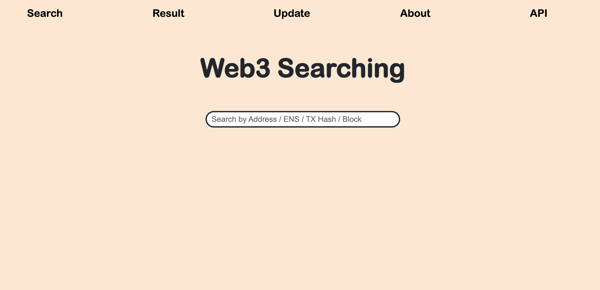

# Web3 Searching Platform

### A website to search the Web3 content. (Builder: Guanlin Jiang)



## Language & Framework

- React.js
- Node.js

## Depoly Usage

- Frontend

```bash
$ cd frontend
$ npm install
$ npm start
```

- Backend

```bash
$ cd backend
$ npm install
$ vim /src/controllers/.env (input the API_Key from Infura & save it)
$ node /src/index.js (the defult port is 8000 run on localhost)
# Reminder: If want command in the background, write the linux .service file and start it!
```

## Content

- Frontend (React.js)
  - Search (Searching by Address & ENS)
  - Result
  - Update
  - About 
  - Connection (Connect to Web3 by Metamask)
- Backend API (Node.js) 
  - Functions & Usage
    - Resolve address by ENS ([Ethereum Name Service](https://ens.domains/))
      - Ex: https://127.0.0.1:8000/api/ens/ethereum.eth
    - Get ETH Balance by address
      - Ex: https://127.0.0.1:8000/api/balance/0x000000000001

## Published Web3 Searching API

- Usage
  - ENS Resolve API - https://web3.skyproton.org/api/ens/'ens domain name'
  - ENS Balance Search API -  https://web3.skyproton.org/api/ens/'ens domain name or ethereum address'
- Chain Support
  - Ethereum
    - Mainnet


!!! Web3 Searching Platform is still in progress !!! - by Guanlin Jiang (David)

